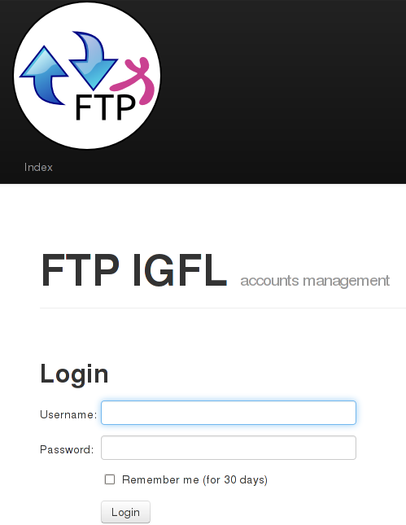
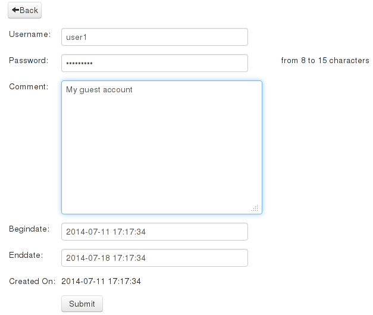
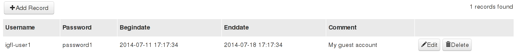

# Create a vsftpd server with guest user creation delegation

The purpose of this project is to provide an FTP service with a simple delegation of guest user accounts creation.  
I wanted to stick on the [KISS](http://en.wikipedia.org/wiki/KISS_principle) principle using basic existing components.

# Pieces of software used

*  [Debian](https///www.debian.org/) latest stable release
*  the [vsftpd](https///security.appspot.com/vsftpd.html) server
*  [PAM](https///wiki.debian.org/LDAP/PAM) modules, that perform both [LDAP](https///wiki.debian.org/fr/LDAP/PAM) and [userdb](http://www.cyberciti.biz/tips/centos-redhat-vsftpd-ftp-with-virtual-users.html) authentication
*  a `bash` script, some cron configuration
*  a [Web2py](http://www.web2py.com/) Web application to manage guest users

# VSFTPD installation and tuning

## installation

```bash
aptitude install vsftpd db-util
```

`db-util` is required to generate the users database file.

## configuration

Edit the `/etc/vsftpd.conf` file:

# base configuration

    dirmessage_enable=YES
    use_localtime=YES
    xferlog_enable=YES
    ftpd_banner=Welcome to the IGFL FTP service.

    # disabling IPV6
    listen=YES
    listen_ipv6=NO

    # disabling anonymous accounts
    anonymous_enable=NO
    anon_upload_enable=NO
    anon_mkdir_write_enable=NO
    anon_other_write_enable=NO

    # enabling non anonymous accounts
    local_enable=YES
    write_enable=YES

    # enabling virtual accounts
    guest_enable=YES
    guest_username=ftp

    # this directory will contain a configuration file per user
    user_config_dir=/etc/vsftpd/user_conf

    # users will be chrooted in their home directory
    chroot_local_user=YES
    secure_chroot_dir=/var/run/vsftpd
    pam_service_name=vsftpd

    # force the port 20 for data transfert (depending on your firewall configuration)
    connect_from_port_20=YES

    # chmod disabled
    chmod_enable=NO
    max_clients=30

    # BUG FIX: vsftpd: refuse to run with writable root inside chroot()
    allow_writeable_chroot=YES

## creation of the user homedir root

```bash
mkdir -p /data/ftp
chown ftp:ftp /data/ftp
```

`ftp` is the `guest_username` define in the `/etc/vsftdp.conf` file. 
Note that this homedir root will be defined in the per user configuration file later.

# LDAP PAM authentication

## installation of libnss-ldap

```bash
aptitude install libnss-ldap
```

## configuration of LDAP

Edit the `/etc/libnss-ldap.conf` file:

    # base DN
    base dc=ens-lyon,dc=fr

    # LDAP URI
    uri ldap://ldap.ens-lyon.fr

    # LDAP options
    ldap_version 3
    rootbinddn rootbinddn 
    scope sub

## configuration of PAM

Create a `/etc/pam.d/vsftpd` file:

    # we activate both LDAP and database file (/etc/vsftpd/login) authentication 
    auth	sufficient	pam_ldap.so
    auth    sufficient 	/lib/x86_64-linux-gnu/security/pam_userdb.so db=/etc/vsftpd/login
    account sufficient 	/lib/x86_64-linux-gnu/security/pam_userdb.so db=/etc/vsftpd/login
    account	sufficient	pam_ldap.so

# First tests

Remember that we use virtual users. We need to define a configuration file per user in the `/etc/vsftpd/user_conf` as specify in the `user_config_dir` variable of the `/etc/vsftpd.conf` file.

## The LDAP users case

I have a `obione` user in my LDAP, so I create a `/etc/vsftpd/user_conf/obione` file:

    # the user home
    local_root=//data/ftp/obione

    # he can write
    write_enable=YES

    # read-only disabled
    anon_world_readable_only=NO

    # he can upload
    anon_upload_enable=YES

    # he can create directories
    anon_mkdir_write_enable=YES

    # he can perform write operations other than upload and create directory
    anon_other_write_enable=YES

    # he has the same privileges as local local users
    virtual_use_local_privs=YES

    # masks
    local_umask=022
    anon_umask=022

Create his homedir:

```bash
mkdir /data/ftp/obione
chown ftp:ftp /data/ftp/obione
```

Obione should now be able to authenticate with his LDAP credentials, read and write on the server.

## The local users case

Local users are defined in the `/etc/vsftpd/login` file (look at the "configuration of PAM" section).

First create a `/etc/vsftpd/login.txt` like:

    user1
    password1
    user2
    password2

Do not forget the carriage return at the end of the file.

Then create the `/etc/vsftpd/login` file with the command:

```bash
cd /etc/vsftpd
db_load -T -t hash -f login.txt login.db
```

You then have just to create a configuration file per user in the `/etc/vsftpd/user_conf/` directory and create the homedirs. Look at "The LDAP users case" just before.

`user1` and `user2` should now be able to authenticate with `password1` and `password2`, read and write on the server.

# Web2py Web application installation

We now have a `vsftpd` installation with both LDAP and guests users authentication.\\
We now want to:

*  allow LDAP users to create/delete guests accounts with an expiration date
*  automatically delete expired accounts and data
*  provide LDAP users a `_GUEST_` directory containing a sub-directory per guest account to exchange data.

    /data/ftp/obione/  
    /data/ftp/obione/_GUESTS_  
    /data/ftp/obione/_GUESTS_/user1  
    /data/ftp/obione/_GUESTS_/user2

I have developed a simple [Web2py](http://www.web2py.com/) application with LDAP authentication to manage the guest users.

---


---


---



## Application installation

Retrieve and unpack the package:

```bash
mkdir /opt/vsftpd_web
cd /opt/vsftpd_web
wget https://thomasbellembois.ddns.net/documents/softwares/vsftpd_web.tar
tar -xvf vsftpd_web.tar
```

Updates and source code available here: [https://sourcesup.renater.fr/projects/s-vsftpd-guest/](https///sourcesup.renater.fr/projects/s-vsftpd-guest/).


## Important files

*  `applications/ftp`: the core application
*  `applications/ftp/models/0.py`: the configuration file
*  `applications/ftp/script/generate_vsftpd_users.py`: a script that create the per user configuration files according to the no expired accounts, the `/etc/vsftpd/login` file and the guest/creator mapping files
*  `applications/ftp/static/images/logo.png`: the application logo 

## Application configuration

Edit the `applications/ftp/models/0.py` file, it is self documented.

Edit the `applications/ftp/script/generate_vsftpd_users.py` file, you may want to change:

*  `ftp_data_dir = '/data/ftp`' with your own ftp homedirs root
*  `vsftpd_conf_dir = '/tmp/vsftpd`', the `vsftpd` configuration directory (that contains the `vsftpd.conf` file) - you need to create it
*  `guest_mapping_conf_dir = os.path.join(vsftpd_conf_dir, 'guest_mapping')`, `guest_mapping` is the directory  containing the user-guests mapping files - you need to create it
*  `user_conf_dir = os.path.join(vsftpd_conf_dir, 'user_conf')`, `user_conf` is the directory containing the per user configuration files
* the user permissions section:
```python  
f_user_conf_file.write("""local_root=/%(ftp_data_dir)s/%(username)s
write_enable=YES
anon_world_readable_only=NO
anon_upload_enable=YES
anon_mkdir_write_enable=YES
anon_other_write_enable=YES
virtual_use_local_privs=YES
local_umask=022
anon_umask=022
""" % {'username': account_username, 'ftp_data_dir': ftp_data_dir})
```

My `vsftpd_conf_dir` is `/tmp/vsftpd` because my `web2py` application is on a different server as my `vsftpd` server. The generated files are then (see next section) `rsync` on the `vsftpd` server.

Creation of the `guest_mapping` and `user_conf` directories:

```bash
mkdir /etc/vsftpd/user_conf
mkdir /etc/vsftpd/guest_mapping
```

## Database considerations

By default the application will use an `sqlite` database located in the `applications/ftp/databases/storage.sqlite` file.  
This configuration is sufficient for a small structure but your may want to use another database. Web2py supports [lots of](http://web2py.com/books/default/chapter/29/06/the-database-abstraction-layer#Connection-strings) databases. The magic is that you do not need to create the table structure. Just create the database, fill in the `settings.database_uri` parameter and the framework will do the job.

## Application start

```
cd /opt/vsftpd_web
./web2py.py -a my_root_password -i 0.0.0.0
```

For more information about the startup options please refer to the [Web2py](http://web2py.com) documentation.  
Your LDAP ussers should be able to authenticate with their credentials.

# Glue

We now have:

1. a `vsftpd` server configured for LDAP and local users
2. a Web application to delegate guests account creation
3. a script `generate_vsftpd_users.py` to generate per user configuration files and user-guest mapping files

We still need to glue these components together.  

The following script does the job:
```bash
#!/bin/bash

# calling the Web2py script to generate the login.txt file and the per user configuration files

/var/www/ftp-accounts/web2py.py -a root -S ftp -M --run=/var/www/ftp-accounts/applications/ftp/script/generate_vsftpd_users.py

# sending the files on the FTP server

# NO REQUIRED IF your web2py application in on the same server as your vsftpd server
rsync -avz /tmp/vsftpd/login.txt root@domu-sharegate.ens-lyon.fr:/etc/vsftpd/
rsync -avz /tmp/vsftpd/guest_mapping root@domu-sharegate.ens-lyon.fr:/etc/vsftpd/

ssh root@domu-sharegate.ens-lyon.fr "rm -f /etc/vsftpd/user_conf/igfl-*"
rsync -avz /tmp/vsftpd/user_conf root@domu-sharegate.ens-lyon.fr:/etc/vsftpd

# vsftpd user database generation

# remove the ssh part if your web2py application in on the same server as your vsftpd server
ssh root@domu-sharegate.ens-lyon.fr "cd /etc/vsftpd; db_load -T -t hash -f login.txt login.db"

# script management call

# remove the ssh part if your web2py application in on the same server as your vsftpd server
ssh root@domu-sharegate.ens-lyon.fr "/root/adm/IGFL/manage_ftp_homedirs"

# cleanup

rm -Rf /tmp/vsftpd
```

My `web2py` application and `vsftpd` server are installed on two different servers. That is wy I need to transfert files generated by the `web2py` script on the `vsftpd` server.

On a full local installation,  remove the `ssh` remote commands and `rsync` commands.

## the manage_ftp_homedirs script

Create an adapt the `/root/adm/IGFL/manage_ftp_homedirs` script:

```bash
#!/bin/bash
now=`date  +"%Y%m%d"`

valid_accounts_file=/tmp/valid_accounts
ftp_data_dir=/data/ftp
ftp_data_disabled_dir=/data/DISABLED
vsftpd_userconf_dir=/etc/vsftpd/user_conf
guest_mapping_dir=/etc/vsftpd/guest_mapping

# finding active vsftpd accounts
find $vsftpd_userconf_dir -type f -exec basename {} \; > $valid_accounts_file

#
# creating new homedirs (guest or igfl members)
#
for account in $(cat $valid_accounts_file)
do
    user_home=$ftp_data_dir/$account
    user=`basename $user_home`
    if [ ! -d "$user_home" ]
    then
        echo "creating $user_home"
        mkdir $user_home;

        if [[ ! $user == igfl-* ]]
        then
            mkdir $user_home/_GUESTS_;
        fi
        chown -R ftp:ftp $user_home;
    fi
done

#
# disabling non active guests bindings
#
for homedir in $(find $ftp_data_dir -maxdepth 1 -mindepth 1 ! -name "igfl-*")
do
    user=`basename $homedir`
    user_home=$ftp_data_dir/$user
    for guest in $(find $homedir/_GUESTS_ -maxdepth 1 -mindepth 1 -exec basename {} \;)
    do
        #echo $guest
        if grep -Fxq $guest $guest_mapping_dir/$user
        then
            #echo "guest $guest exists for user $user"
            :
        else
            echo "removing guest binding $guest for user $user"
            umount $ftp_data_dir/$guest $user_home/_GUESTS_/$guest
            rmdir $ftp_data_dir/$guest $user_home/_GUESTS_/$guest
        fi
    done
done

#
# creating igfl members `<->` guest bindings for active guests
#
for binding_file in $(find $guest_mapping_dir -type f)
do
    user=`basename $binding_file`
    user_home=$ftp_data_dir/$user

    for guest in $(cat $binding_file)
    do
        #echo "$user has guest $guest"
        if [ ! -d "$user_home/_GUESTS_/$guest" ]
        then
            echo "creating guest binding $guest for user $user"
            mkdir $user_home/_GUESTS_/$guest
            mount --bind $ftp_data_dir/$guest $user_home/_GUESTS_/$guest
        fi
    done
done

#
# disabling non active guest homedirs
#
for homedir in $(find $ftp_data_dir -type d -name "igfl-*")
do
    user=`basename $homedir`

    if grep -Fxq $user $valid_accounts_file
    then
            #echo "$user is valid"
        :	
    else
            echo "disabling $user homedir"
        mv "$ftp_data_dir/$user" "$ftp_data_disabled_dir/$user-DISABLED-$now"
    fi
done
```

The script does not delete the expired accounts but moves them into the `/data/DISABLED` directory instead.

# References

- [http://www.cyberciti.biz/tips/centos-redhat-vsftpd-ftp-with-virtual-users.html](http://www.cyberciti.biz/tips/centos-redhat-vsftpd-ftp-with-virtual-users.html)
- [Web2py](http://web2py.com)
- [https://sourcesup.renater.fr/projects/s-vsftpd-guest/](https///sourcesup.renater.fr/projects/s-vsftpd-guest/)


