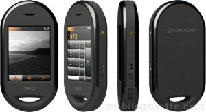
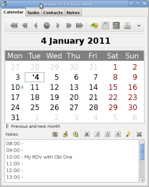
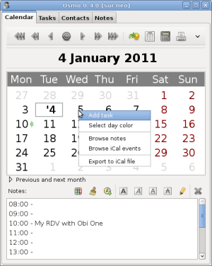
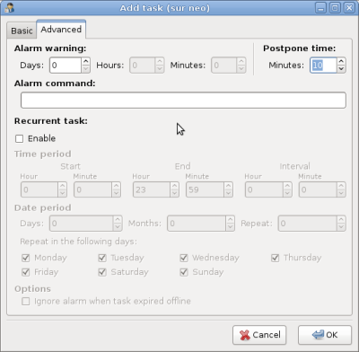

# The Openmoko Freerunner

I am the happy owner of an [Openmoko freerunner](http://en.wikipedia.org/wiki/Neo_FreeRunner) phone. 



The freerunner is the first Open smartphone able to run under different OS.
I am still trying to make it usable has a daily phone.

My needs are:

*  telephoning :-)
*  a decent PIM suite with a synchronization feature
*  sometimes a GPS application to find my way
*  that's all !

I currently use as a daily phone:

*  a Nokia E61i
*  a personal [Funambol](http://www.funambol.com/) SyncML server
*  IceOWL (Lightning) with the Funambol plugin

I am quite happy with this configuration. I have no synchronization problem except with tasks that are sometimes duplicated.

I run every 5 minutes a Python script to solve this issue.

```python
#!/usr/bin/python
# -*- coding: utf-8 -*-
import sqlite3
DB = '/home/tbellemb/.icedove/s8x9mkxm.default/calendar-data/local.sqlite'
conn = sqlite3.connect(DB)
c = conn.cursor()
c.execute('''select id from cal_todos GROUP BY title HAVING count(*) >1''')
result = c.fetchall()
for row in result:
    #print row
    id = (row[0],)
    print 'deleting task with id=%s' %id
    c.execute('delete from cal_todos where id=?', id)
    conn.commit()
c.close()
```

# The freerunner is

*  a geek toy :-)
*  not an IPhone/HTC/phone_for_my_mom killer
*  a good choice if you like the idea to apt-get install an application an setup a cron on your phone
*  a bad choice if you want to have a ready-to-use phone (even though OS are more and more stable) - you will need some efforts to set it up

# OS tests

I have tested many [distributions](http://wiki.openmoko.org/wiki/Distributions) such as:

*  the first **OM2009** (now deprecated)
*  **SHR**
*  **hackable:1** replaced now by [deforaOS](http://www.defora.org/)
*  **android**
*  **QTMoko**
*  **debian**

 1.  **SHR** looks to be the most used OS. It is usable as a daily phone. But I don't like the GUI and I find it not fast enough.
 2.  I loved the Debian based **hackable:1**, nice GUI, used the [evolution](http://projects.gnome.org/evolution/) back-end for the PIM suite - so easily sync-able with a desktop application. But hackable:1 is dead now and has just been replaced by deforaOS - not tested yet...
 3.  **Android** is really slow. But I have not tested it really deeply.
 4.  **QTMoko** is a Debian based distribution with a Qtopia interface. It is a really good choice (the best one in my point of view). The GUI is clear and fast. This distribution is well maintained. You have a ready to use phone. But even if there is a decent PIM suite, there is no synchronisation feature. This is the only discriminating point for me. 
 5.  **debian** could be a good alternative, but needs lots of hacks.

# Battery life and recamping bug

The freerunner battery life is... well... bad !

This is due to:

*  a [bug](http://wiki.openmoko.org/wiki/1024#Enabling.2Fallowing_Calypso_GSM_modem_deep_sleep) that makes the gsm modem oscillating between registered / not-registered.
*  a too small original battery

I have fixed the recamping bug. It is not a so hard task. I could not find a 10 micro Farad ceramic capacitor, so I have used a 10 micro farad tantalum capacitor instead. One difference is that tantalum capacitors have a polarity. I have just soldered the - component lead to the ground.

After that, don't forget to modify the */etc/frameworkd.conf* file:

    ti_calypso_deep_sleep = always

I have not yet changed my battery. I will do it soon.

# The Debian way

## Introduction

The [DebianOnFreeRunner](http://wiki.debian.org/DebianOnFreeRunner) is a very good start point to make Debian running on the Freerunner. I strongly recommend to use a swap partition (mine is 100MB). Once the installation is finished, you will have a running Phone with [Zhone](http://wiki.openmoko.org/wiki/Zhone) to receive and make calls and SMS.

Zhone is said to be a demo application but it is quite usable and fast. I have modified the default Zhone theme (look at the /usr/share/zhone/zhone.edj file) using [Edje](http://wiki.openmoko.org/wiki/Edje) (available in the Debian Sid repository).

I use [LXDE](http://wiki.openmoko.org/wiki/Debian#LXDE) as a Desktop environment.

##  Install

You must have an OS installed on the NAND.
Insert a microSD blank card. Boot on QTopia. Connect with SSH.

```bash
# installing required packages
apt-get update
apt-get install rdate binutils
cd /tmp
wget -O install.sh http://pkg-fso.alioth.debian.org/freerunner/install.sh
chmod +x install.sh
SD_SWAP_SIZE=100 INST_MIRROR=http://ftp.de.debian.org/debian QI=true SINGLE_PART=true ROOT_PASSWORD=root ./install.sh all
```

have a coffee...
reboot..
install some packages

```bash	
apt-get install leafpad lxterminal gnome-themes-extras omhacks xserver-xorg-video-glamo vim sudo libgtkstylus
#apt-get install fbpanel gtk2-engines gtk-theme-switch hicolor-icon-theme libgtkstylus
# hicolor-icon-theme for fbpanel
# libgtkstylus for right click
apt-get install lxde
```

I got a flickering problem with fbpanel. Using LXDE instead.

use *glamo* instead of *fbdev*

```bash
sed -i 's/fbdev/glamo/' /etc/X11/xorg.conf
```

configure sleep mode

```bash	
sed -i 's/TI_CALYPSO_DEEP_SLEEP = adaptative/TI_CALYPSO_DEEP_SLEEP = always/' /etc/frameworkd.conf
```

running X as a normal user

```bash	
# messagebug group necessary ?
useradd -m -G audio,dialout,floppy,video,staff,messagebus tbellemb
passwd tbellemb
sed -i 's/NODM_USER=root/NODM_USER=tbellemb/' /etc/default/nodm
sed -i 's/allowed_users=console/allowed_users=anybody/' /etc/X11/Xwrapper.config
cp /root/.xsession /home/tbellemb/
chown tbellemb:tbellemb /home/tbellemb/.xsession
chown tbellemb:tbellemb /tmp/zhone.log
```

reboot to start X as normal user...

my `.xsession` file

    #!/bin/sh

    # right click support
    export GTK_MODULES=libgtkstylus.so
    startlxde

my `/etc/xdg/lxsession/LXDE/autostart`

    ...
    @openmoko-panel-plugin
    @zhone

configure look

```bash
obconf
obmenu
lxappearence
```

##  Change Zhone look

Install `libedje-bin` the PC from the Debian Sid repository and retrieve the theme from the Freerunner.

```bash
cd /tmp
scp root@192.168.0.202:/usr/share/zhone/zhone.edj .
```

Uncompile the theme

```bash
edje_decc zhone.edj
```

[Customize](http://wiki.openmoko.org/wiki/Edje) the theme, recompile it and send it to the Freerunner.

```bash	
cd /tmp/zhone
./build.sh
scp zhone.edj root@192.168.0.202:/usr/share/zhone/zhone.edj
```

Well... I am an happy geek with a Debian running on my phone but... I need to find now a good PIM suite.

## Looking for the good PIM suite

### OSMO

[OSMO](http://clayo.org/osmo/) is a handy personal organizer, which includes calendar, tasks manager, address book and notes modules. The GUI is very comfortable to work with, especially on a small screen (use the --tinygui parameter).

OSMO uses XML files to store data and provides an ICAL export. There is a SyncML feature but I have not tested it yet because the Debian package is compiled without this option. Anyway it should not be difficult to synchronize it with a desktop OSMO.



In the *calendar* view you can organize your days, add and categorize events. 



You can also add tasks with plenty of options such as recurrence and alarm



You also have well made *contacts* and *notes* features. 

For notifications I use `play` (default configuration) and `xmessage`.

```bash
apt-get install sox x11-utils
```

In "preferences>tasks":

global notification command : `/usr/bin/xmessage -near An OSMO task awaits your attention &`

:-)

*  very nice application with a small but efficient GUI - well integrated to the desktop with an icon in the notify area
*  XML data file with ICAL export = easily sync-able with a desktop application
*  lots of options and features such as recurrent tasks, alarms, categories...

:-(


*  events... are not really events. I mean that if you need an alarm for an appointment you will have to enter a task. Anyway this is not really a bad point. Having tasks and events on the same window is also a good think.
*  only nearest recurrent tasks are visible in the calendar view 
*  ICAL import: OSMO is said to be able to import ICAL files. But I could not manage to do that. I could only browse my ICAL events but not import them as tasks. Well... I small Python script should solve this problem. ;-)
*  a little bit slow on the Freerunner. But it is probably due to a bad configuration of my Phone.

### ETM

[ETM](http://www.duke.edu/~dgraham/ETM/) is a [remind](http://www.roaringpenguin.com/products/remind) like event and task manager written in Python (WX). It is a full featured application that support recurrent tasks, alarms and exceptions. The main idea of ETM is to add items just with a line of text.

For example:

	* sales meeting @d 25 @s 9a @e 10a @a 5

It is a very fast and convenient way to manage PIM information on a small device.

The problem is that ETM is not designed to run on a small screen. So I add to hack a little bit the code to make the GUI fit on the Freerunner screen.

I still have to make code modification to see if this application is usable on the Freerunner.

# The deforaOS way

I have started to investigate the [deforaOS](http://www.defora.org/) OS. It is a Debian based distribution with gnome as a GUI.

## Installation

I have chosen the SDCard installation to keep my QTMoko OS on the nand.

### Partitioning

I have a 4GB SD card. You [need](http://www.hackable1.org/wiki/Installation) at least a 8MB VFAT partition and the rest as ext2. I have choosen to add a 100MB swap partition.

Connect the SD on a PC (check that old partitions on the card are not automatically mounted) and partition it:

    sdb1: 8M VFAT
    sdb2: 100M swap
    sdb3: the rest EXT2

Mount the 2 partitions:

```bash
cd /mnt
sudo mkdir vfat
sudo mkdir ext2
sudo mount /dev/sdb1 vfat
sudo mount /dev/sdb3 ext2
sync
sudo umount /mnt/vfat
sudo umount /mnt/ext2
```

[Download](http://build.hackable1.org/releases/) the tar.gz archive and the uImage*.bin file.

```bash
cd /tmp
wget http://build.hackable1.org/releases/dse2-beta/uImage-GTA02.bin
wget http://build.hackable1.org/releases/dse2-beta/Hackable1-Openmoko-Freerunner-phone-2011.03a.tar.gz
```

Copy **and rename** the .bin file to the vfat partition and untar the archive to the ext2 partition.

```bash
cd /mnt/vfat
sudo cp /tmp/uImage-GTA02.bin ./uImage.bin
cd /mnt/ext2
sudo tar zxvf /tmp/Hackable1-Openmoko-Freerunner-phone-2011.03a.tar.gz
```

Insert the SD into the freerunner and reboot.

You should be able to use Qi as a bootloader. I have used Uboot.

to be finished...

# Conclusion

For me, the best distribution is QTMoko. It is really very fast and the GUI is easy to use. You have a ready to use phone with basic feature such as phone, SMS, calendar, different profiles (vibrator, silent...) and many applications. A bad point for me is the agenda. Even if you can enter events very easily, add notes, alarms and recurring events, on only have the choice between a month and a day view. It is not possible to see at a first glance all your appointments for a week. The month view just highlight days with events but does not display event titles.

I have played a lot with Debian. You need to tweak it to make it sexy. :) It is also a good choice but the PIM debian packages (such as OSMO) are not designed to run on small devices.

I am still testing DeforaOS which is at its really first stage of its development.

I have tested the GPS only at the beginning with many distributions. It worked well.

The Freerunner **is now usable as a daily phone**, especially with SHR, QTMoko and Debian. What I really really miss I a descent PIM suite with a working synchronization feature. I use it every day with my Nokia E61i and I can not imagine working without it !

Anyway, the Freerunner is a very addictive toy. It is especially a great Open Source project. If I add more time, I would like to be able to develop the features I need. 

# Notes

## Flashing NAND

Example for the QTMoko distribution.

Download files at http://sourceforge.net/projects/qtmoko/files

Press AUX button first, hold it and press Power button. Wait until NOR flash U-Boot menu appears then:

```bash
sudo dfu-util -a u-boot -R -D qi-31.udfu
sudo dfu-util -a kernel -R -D uImage-v31.bin
sudo dfu-util -a rootfs -R -D qtmoko-debian-v31.ubi
```

## Networking

my `/etc/network/interfaces` file:

    # freerunner
    allow-hotplug usb0
    iface usb0 inet static
            address 192.168.0.200
            netmask 255.255.255.0
            up iptables -A POSTROUTING -t nat -s 192.168.0.0/24 -j MASQUERADE
            up echo 1 > /proc/sys/net/ipv4/ip_forward
            down iptables -D POSTROUTING -t nat -s 192.168.0.0/24 -j MASQUERADE

Freerunner reachable at `192.168.0.202`.

# Links

*  [Openmoko's Debian on Freerunner wiki](http://wiki.openmoko.org/wiki/Debian) Openmoko's Debian on Freerunner wiki
*  [Debian on Freerunner wiki](http://wiki.debian.org/DebianOnFreeRunner)
*  [The QI bootloader](http://wiki.openmoko.org/wiki/Qi)
*  [Moving Debian to flash](http://wiki.debian.org/DebianOnFreeRunner/MovingToFlash)
*  [TimoJyrinki's Debian on Freerunner page](http://wiki.openmoko.org/wiki/User:TimoJyrinki) 
*  [Edje utils](http://wiki.openmoko.org/wiki/Edje)
*  [Recamping bug](http://wiki.openmoko.org/wiki/1024#Enabling.2Fallowing_Calypso_GSM_modem_deep_sleep)
*  [Recamping bug](http://www.neofundas.blogspot.com/)
