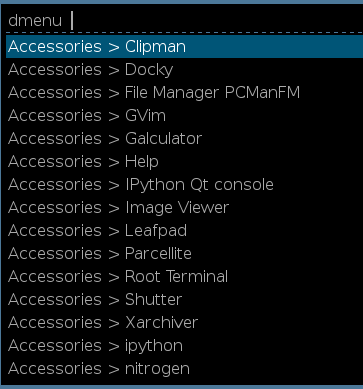

# An i3 start menu



I have developped a small python script based on the [xdg_menu](http://pkgs.fedoraproject.org/cgit/openbox.git/tree/xdg-menu) script to create a start menu for i3. This script displays the applications by categories based on .menu files in the `/etc/xdg/menus/` directory.

## Install the script

Copy this code in `/usr/local/bin/i3_menu`:

```python
#!/usr/bin/python
#
# Copyright (C) 2008  Red Hat, Inc.
#
# This program is free software; you can redistribute it and/or modify
# it under the terms of the GNU General Public License as published by
# the Free Software Foundation; either version 2 of the License, or
# (at your option) any later version.
#
# This program is distributed in the hope that it will be useful,
# but WITHOUT ANY WARRANTY; without even the implied warranty of
# MERCHANTABILITY or FITNESS FOR A PARTICULAR PURPOSE.  See the
# GNU General Public License for more details.
#
# You should have received a copy of the GNU General Public License
# along with this program.  If not, see <http://www.gnu.org/licenses/>.
#
# Author(s): Luke Macken <lmacken@redhat.com>
#            Miroslav Lichvar <mlichvar@redhat.com>
#            Edward Sheldrake <ejsheldrake@gmail.com>
# 20141103
# Thomas Bellembois <thomas.bellembois@gmail.com>
# - script modified for i3 dmenu/rofi 

import xdg.Menu, xdg.DesktopEntry, xdg.Config
import re, sys, os
import subprocess
from xml.sax.saxutils import escape

printf_exe = "/usr/bin/printf"
# use "dmenu" or "rofi -dmenu"
#dmenu_exe = "/usr/bin/dmenu"
#dmenu_args = []
dmenu_exe = "/usr/local/bin/rofi"
dmenu_args = [ "-dmenu" ]
# Accessories > Leafpad for example
category_separator = " > "

icons = True
try:
	from gi.repository import Gtk
except ImportError:
	icons = False

def icon_attr(entry):
	if icons is False:
		return ''

	name = entry.getIcon()

	if os.path.exists(name):
		return ' icon="' + name + '"'

	# work around broken .desktop files
	# unless the icon is a full path it should not have an extension
	name = re.sub('\..{3,4}$', '', name)

	# imlib2 cannot load svg
	iconinfo = theme.lookup_icon(name, 22, Gtk.IconLookupFlags.NO_SVG)
	if iconinfo:
		iconfile = iconinfo.get_filename()
		if hasattr(iconinfo, 'free'):
			iconinfo.free()
		if iconfile:
			return ' icon="' + iconfile + '"'
	return ''

def escape_utf8(s):
	if isinstance(s, unicode):
		s = s.encode('utf-8', 'xmlcharrefreplace')
	return escape(s)

def entry_name(entry):
	return escape_utf8(entry.getName())

def walk_menu(entry, cat=None):
        global menu_dict
	if isinstance(entry, xdg.Menu.Menu) and entry.Show is True:
		cat = entry_name(entry)
                map(lambda e: walk_menu(e, cat), entry.getEntries())
	elif isinstance(entry, xdg.Menu.MenuEntry) and entry.Show is True:
		name = entry_name(entry.DesktopEntry)
		command = re.sub(' -caption "%c"| -caption %c',
			' -caption "%s"' % name,
			escape_utf8(entry.DesktopEntry.getExec()))
		command = re.sub(' [^ ]*%[fFuUdDnNickvm]', '', command)
		if entry.DesktopEntry.getTerminal():
			command = 'xterm -title "%s" -e %s' % (name, command)
                #print '%s:%s -> %s' % (cat, name.replace('"', ''), command)
                menu_dict['%s%s%s' % (cat, category_separator, name.replace('"', ''))] = command

menu_dict = {}

if len(sys.argv) > 1:
	menufile = sys.argv[1] + '.menu'
else:
	menufile = 'applications.menu'

lang = os.environ.get('LANG')
if lang:
	xdg.Config.setLocale(lang)

# lie to get the same menu as in GNOME
xdg.Config.setWindowManager('GNOME')

if icons:
  theme = Gtk.IconTheme.get_default()

menu = xdg.Menu.parse(menufile)

map(walk_menu, menu.getEntries())

_dmenu_commands = ""
for k, v in sorted(menu_dict.items(), key=lambda item: item[0]):
    _dmenu_commands = _dmenu_commands + "%s\n" % k
    
print_process =  subprocess.Popen([printf_exe, _dmenu_commands], stdout=subprocess.PIPE)
dmenu_out = subprocess.check_output([dmenu_exe] + dmenu_args, stdin=print_process.stdout)

subprocess.Popen(menu_dict[dmenu_out[:-1]], shell=True)

exit(0)
```

## Adapt the script

You can use either dmenu or the most advanced [Rofi](https://davedavenport.github.io/rofi/) menu. Adapt the `dmenu_exe` and `dmenu_args` variables at the beginning of the script.

```bash
...
# use "dmenu" or "rofi -dmenu"
#dmenu_exe = "/usr/bin/dmenu"
#dmenu_args = []
dmenu_exe = "/usr/local/bin/rofi"
dmenu_args = [ "-dmenu" ]
...
```

## Test the script

I have installed the `lxde-applications.menu` from the `lxmenu-data` package but any other .menu file should work.

```bash
i3-menu /etc/xdg/menus/lxde-applications
# the menu should appear !
```

## i3 binding

You now just have to ind keys to make the menu appear. Edit your `.i3/config` file:

```bash
...
bindsym $mod+Ctrl+d exec i3-menu  /etc/xdg/menus/lxde-applications
...
```
