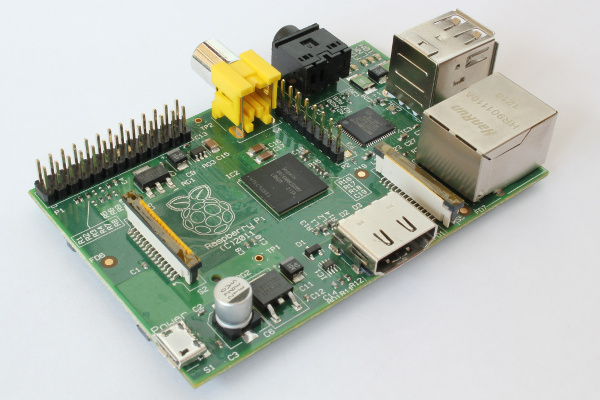
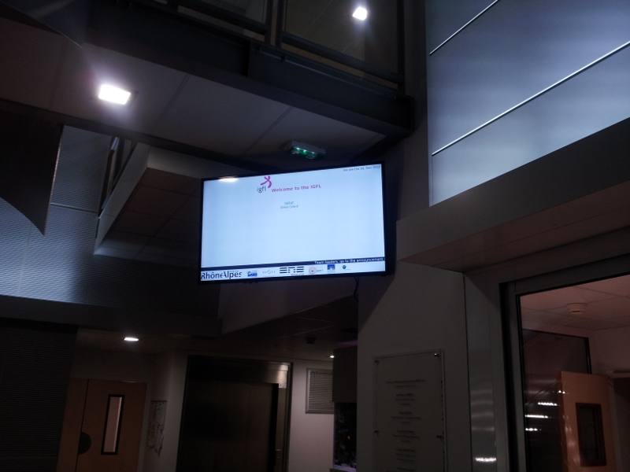
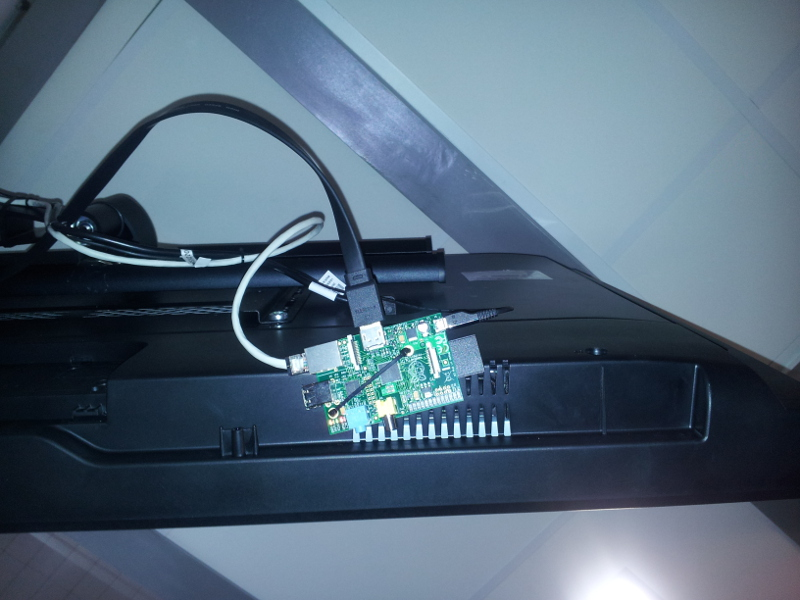
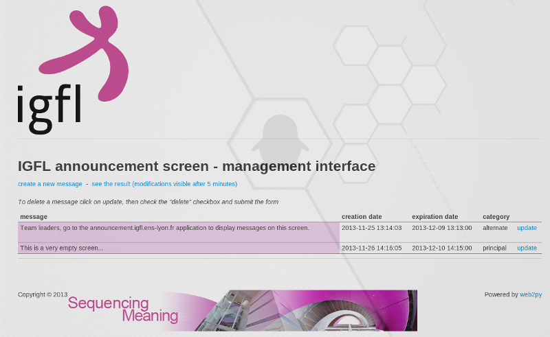

## create an announcement screen with a raspberry pi

You can create a simple announcement screen with a monitor and a [Raspberry Pi](http://www.raspberrypi.org/) board. The Raspberry Pi is a "credit-card sized computer that plugs into your TV and a keyboard".





The system consists on:

*  a Raspberry Pi running the [Raspdebian](http://www.raspbian.org/) operating system 
*  a classic display screen running a Web browser 
*  a Web application to post announces 
*  a piece of software to generate the final Web page loaded on the screen 

I have developed a small Web application with the [Web2py](http://www.web2py.com/) framework. Please refer to the [Web2py site](http://www.web2py.com/init/default/download) to install the framework. It is really easy (download, unzip and run).

Please email me for the source code of the application.

This application will give you the following interface.




An announcement has:

*  a text 
*  a creation date, I do not use it yet 
*  an expiration date, used by the software generating the final Web page to select only not expired announcements 
*  a category, principal or alternate. Principal announcements are displayed at the center of the screen, alternate ones in a banner at the bottom of the screen 

The announcements are stored in a sqlite database (other databases possibles, look at the Web2py documentation). A Web2py script `scripts/generate_html.py` generates the final page in the `static/output` directory.

I call this script every 3 minutes in a crontab and **rsync** the `output` directory to the Raspberry Pi.

```       
# - "ecran" is the name of the Web2py application
# /var/www/web2py is the Web2py framework installation directory
# the "-a root" option provides the password of the Web2py administration interface, not used here, but his parameter is needed
# the "-S ecran -M" option ask Web2py to run a shell for the "ecran" application and load the models (databases)
# the "--run" option runs the script given in parameter
# "ecran-accueil.igfl.ens-lyon.fr" is the Raspberry Pi


*/3 * * * * root /var/www/web2py/web2py.py -a root -S ecran -M --run=/var/www/web2py/applications/ecran/script/generate_html.py > /dev/null 2>&1; rsync -avz /var/www/web2py/applications/ecran/static/output/* root@ecran-accueil.igfl.ens-lyon.fr:/home/pi/panneau/ > /dev/null 2>&1;
```

On the Raspberry Pi I launch a chromium browser in fullscreen mode at startup. We can achieve this with the `.config/openbox/autostart` file.
	
```	            
#! /bin/bash
# some cleanup
rm -rf /home.pi/.cache
rm -rf /home/pi/.config/chromium
# DISPLAY=:0 force chromium to use the principal display. There is a :1 display for the VNC server
DISPLAY=:0 chromium /home/pi/panneau/panneau_affichage.html &
sleep 10
# simulate a F11 to put chromium in fullscreen
DISPLAY=:0 xdotool key F11
```

We then need to refresh the screen regularly.

```
# simulate a F5 to refresh chromium
*/3 * * * * pi DISPLAY=:0 xdotool key F5
```

